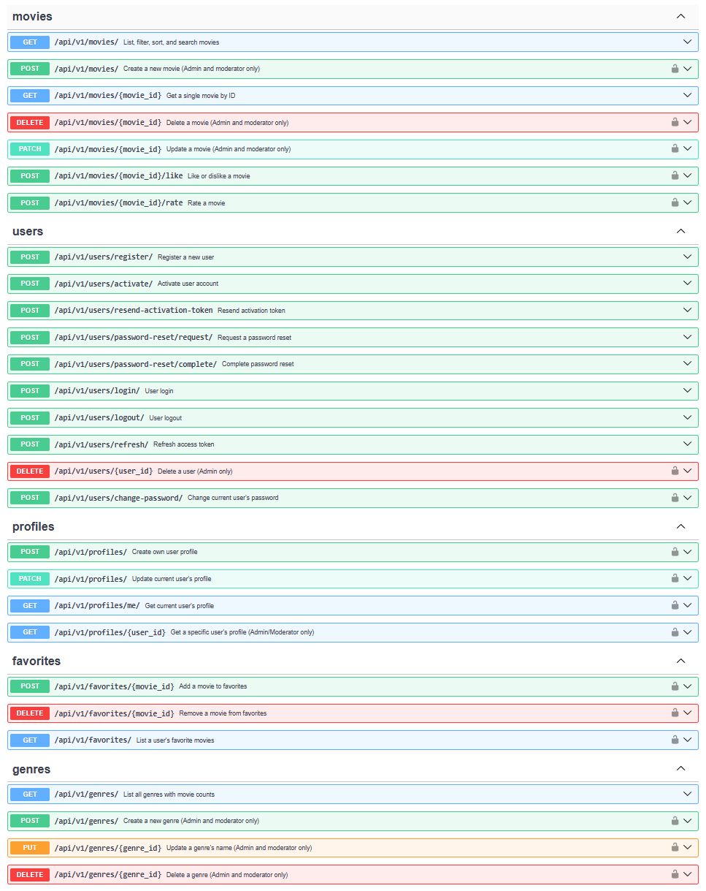
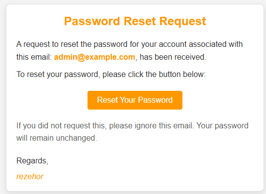
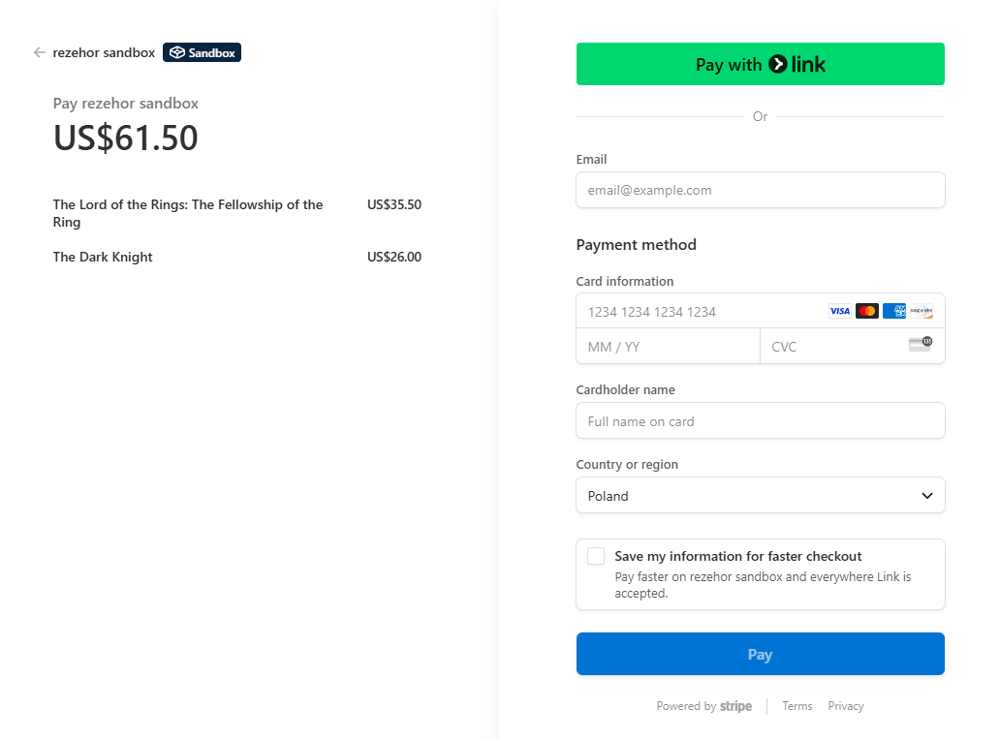

# Online Cinema API Service 🎬

## Description
Online Cinema API Service is a web-based platform that allows users to browse,
manage, and purchase movies via the internet. Built with FastAPI,
this system provides a complete digital experience for movie lovers,
with functionality for authentication, movie catalog, favorites, shopping cart,
payments, and more. It supports role-based access and is fully containerized
with Docker for easy deployment.

## Live Demo
The project is deployed on AWS EC2, containerized with Docker, and served through NGINX with basic HTTP authentication.
You can access the live version here:

http://35.158.6.233/docs

### NGINX Access
- Login: rezehor
- Password: rezehor
### Admin authorization
- Login: admin@example.com
- Password: Admin1234!

## Project Features:
- **🔐 Authentication & User Management:**
  - Email registration with activation link (valid for 24 hours)
  - Ability to resend activation link if expired
  - Expired tokens deleted via celery-beat
  - JWT authentication: access + refresh tokens
  - Password change (with old password) and reset (via email)
  - Role-based access:
    * User – browse, buy, and interact with movies
    * Moderator – manage movies, genres, actors, view sales
    * Admin – full access to users, roles, and manual activation
- **🎞️ Movies:**
  - Browse movie catalog with pagination
  - Detailed movie pages with description
  - Like/dislike functionality
  - Filter by release year, IMDb rating, genre
  - Sort by price, popularity, release date
  - Search by title, actor, director, or description
  - Rate movies (1–10 scale)
  - Add/remove favorites + filter/sort/search favorites
  - Genre list with movie counts
- **🛒 Shopping Cart:**
  - Add movies to cart (if not already purchased)
  - View, remove, or clear items in cart
  - Pay for all movies in one click
  - Movies move to "Purchased" after payment
  - Validation:
    * Prevent duplicates or already-purchased movies
    * Prompt guest users to register before checkout
    * Check availability before creating an order
- **📦 Orders:**
  - Place orders for cart contents
  - View list of orders
  - Cancel orders before payment
  - Payment confirmation via email
  - Validation:
    * Exclude unavailable or purchased movies
    * Ensure cart isn't empty
    * Recheck prices before payment
  - Admins can filter and view all user orders
- **💳 Payments:**
  - Stripe integration for secure payments
  - Payment confirmation on-site and via email
  - View payment history
  - Webhook validation and order status updates
  - Admins can filter all payments
- **🐳 Docker & Docker Compose:**
  - Full containerization with Docker
  - Use Docker Compose to manage services:
    * FastAPI, Redis, Celery, MinIO, PostgreSQL, pgAdmin, Alembic, MailHog, NGINX
- **📦 Poetry for Dependency Management:**
  - Manage dependencies with Poetry
  - pyproject.toml for version control and setup

## Installation and Setup
To get started with the Online Cinema API Service, follow these steps:
### Step 1: Clone the Repository
```bash
git clone https://github.com/rezehor/cinema-online.git
```

### Step 2: Environment Variables
You'll need two .env files — one for the backend and one for NGINX:

Main Project Directory:
```bash
cp .env.sample .env (Linux / macOS)
copy .env.sample .env (Windows)
```
Nginx Configuration Directory:
```bash
cp docker/nginx/.env.sample docker/nginx/.env (Linux / macOS)
copy docker/nginx/.env.sample docker/nginx/.env (Windows)
```
**After copying, make sure to open each .env file and replace sample values with your own**

### Step 3: Run with Docker
```bash
docker-compose up --build
```

## Service URLs
Docs (Swagger API documentation)
```bash
http://localhost:8000/docs
```
Redoc (Redoc API documentation)
```bash
http://localhost:8000/redoc
```
Mailhog (Mail viewer (for test emails))
```bash
http://localhost:8025
```
PgAdmin (PostgreSQL management GUI)
```bash
http://localhost:3333
```
MinIO (S3-compatible file storage)
```bash
http://localhost:9001
```

### 📄 Swagger Documentation


### 📧 Email Notification (Password Reset)


### 💳 Stripe Payment Integration

